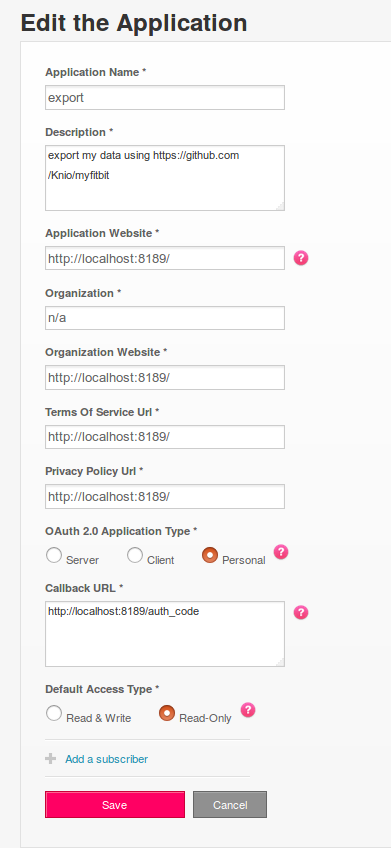

**NB: This is a fork. I just added a few things to experiment a bit. The Knio version is most probably actively developed. Consider using that one.**

# MyFitbit


## Installation


Manual:

```
git clone https://github.com/vilhelmp/myfitbit.git
cd myfitbit
python3 setup.py install
```
or for development

```
python3 setup.py develop
```

## Setup

1. Register a new app at https://dev.fitbit.com/apps/new

The app should look like this:

The Callback URL must be exactly `http://localhost:8189/auth_code`




2. Configure the API keys

Make a file `myfitbit.ini` in your working directory with the client ID and secret you got from registering the fitbit app:

```
[fitbit_auth]
client_id = 123ABCD
client_secret = 0123456789abcdef0a1b2c3d4f5
```

2. Export your data

```
python3 -m myfitbit
```

This will open a web browser and prompt you to allow the app to access your data.

It will then begin exporting to your current working directory.

Note that the fitbit API is rate limited to 150 calls/hour, and you can query only 1 day of heartrate data at a time. If you many days of data, you will be rate limited and see an HTTP 429 error. Simply re-run the command an hour later and it will resume downloading where it left off.

Once you have run this command you can rerun it regularly without the need to allow access every time.


3. Generate report


```
python3 -m myfitbit.report --user 123ABC
```

Use the user id seen in the folder created in your directory (where all the data live)

This will generate `report.html` in your current working directory.

This might take a long time to load depending on how much data you have.


